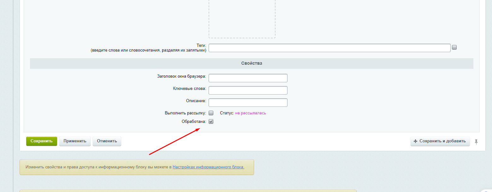

Как проверять
================

[Новости находятся здесь](https://trainee6.xn----gtbdfujo3d.xn--p1ai/bitrix/admin/iblock_list_admin.php?IBLOCK_ID=1&type=news&lang=ru&find_section_section=-1)

Свойство обработанности


[Таблица, в которой хранятся активные на данный момент задачи по обработке](https://trainee6.xn----gtbdfujo3d.xn--p1ai/bitrix/admin/perfmon_table.php?lang=ru&table_name=bx_news_processing)

[Агент крутится раз в минуту](https://trainee6.xn----gtbdfujo3d.xn--p1ai/bitrix/admin/agent_edit.php?ID=8951&lang=ru) 

Все завернуто в модуль ```bx.news```, он уже установлен 
                                                  
Процесс работы: 
------------

1) Новость создается или редактируется
2) Отправляется запрос create_work в сервис
3) В таблицу bx_news_processing добавляется запись 
4) Поле "Обработано" новости становится неустановленным

1) Агент считывает таблицу
2) Для каждой записи делается запрос check-work в сервис
3) Если обработка в сервисе завершена, то 
4) ставится чебокс "Обработано" у новости
5) удаляется запись из таблицы

Предусмотренные крайние ситуации:
------------

1) Если редактируем новость несколько раз подряд. А за это время таск на сервисе выполниться не успеет. Сервис вернет id последнего реквеста, мы его обновляем в записи в таблице, соответствующе данной новости (несколько записей в таблице для одной и той же новости создано быть не может). И работаем мы, соответственно, с последним из запустившихся тасков. 

2) Если удаляем новость. Из таблицы удаляется запись, соответвующая этой новости, если таковая есть. И с данного момента проверка статуса таска для этой удаленной новости производиться не будет. 